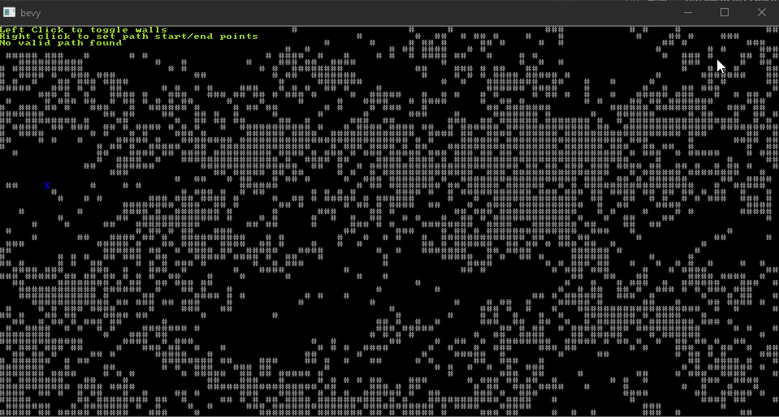

[](https://opensource.org/licenses/MIT)
[](https://crates.io/crates/sark_pathfinding/)
[](https://docs.rs/sark_pathfinding/)

A simple implementation of the [astar pathfinding algorithm](https://www.redblobgames.com/pathfinding/a-star/implementation.html) 
from red blob games.

In order to use the pathfinder you must have a path map for it to navigate. You can
define one by implementing the `PathingMap` trait, or you can use the built-in
`PathMap2d`.

# Example

```rust
use sark_pathfinding::*;

let mut map = PathMap2d::new([50,50]);
let mut pf = Pathfinder::new();

// Set position [5,4] of the path map to be a pathfinding obstacle.
map[5,4] = true;

let path = pf.astar(&map, [4,4], [10,10]).unwrap();
```



*From the "terminal" example.*//! A simple implementation of the [astar pathfinding algorithm](https://www.redblobgames.com/pathfinding/a-star/implementation.html)
