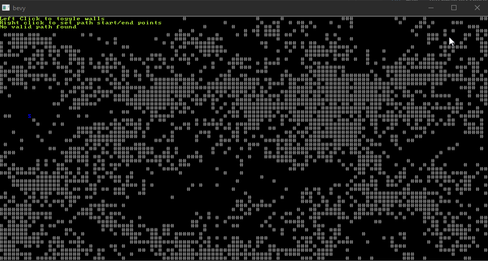

[](https://opensource.org/licenses/MIT)
[](https://crates.io/crates/sark_pathfinding/)
[](https://docs.rs/sark_pathfinding/)

A simple implementation of the [astar pathfinding algorithm](https://www.redblobgames.com/pathfinding/a-star/implementation.html) 
from red blob games.

In order to use the pathfinder you must have a path map for it to navigate. You can define one by implementing the `PathingMap` trait, or you can use the built-in `PathMap2d`.

# Example

```rust
use sark_pathfinding::*;

// Create a 50x50 map with all nodes set to false (no obstacles)
let mut map = PathMap2d::default([50,50]);

// Create an obstacle at position [5,5]
map[[5,5]] = true;

// Find our path
let mut astar = AStar::from_size([50,50]);
let path = astar.find_path(&map, [4,4], [10,10]).unwrap();
```



*From the "terminal" example.*